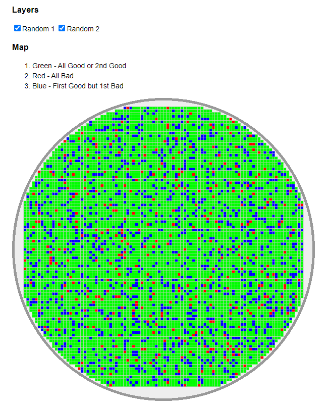
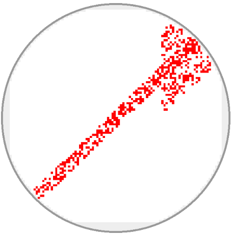
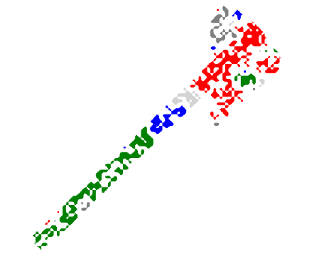

uia-wafermap
===

## Description
The project is in progress. The core design is based on STDF V4 format.

* Use maxX, maxY, minX, minY to setup the die size in canvas.
* No need to has the result of all (x,y).

## How to build
1. Install __rollup.js__ package.
```
npm install -g rollup
```

2. Change to the project directory and install dependencies modules.
```
npm install
```

3. Test the project.
```
npm run test
```

4. Build the project and output the result to __dist/uia-wafermap.js__.
```
npm run build
```

## Examples
### Example1
```js

// create a shotmap
var shotmap = uia.shotmap('wafer2')         // element id
    .size(600, 10)                          // size of canvas
    .notch("down")                          // notch direction
    .wheel(true)                            // use the wheel to control zoom in & out 
    .drag(true)                             // drag and drop the map
    .diePalette(function(value) {           // color palette, the value passed from result function.
      switch(value) {
        case 0:                             // pass
          return 0x00ff00;                  // green
        case 1:                             // fail
          return 0xff0000;                  // red
        case 2:                             // good to bad
          return 0xff0000;                  // red
        default:                            // unknown
          return 0xffffff;                  // white
      }
    })

// bind data to the shotmap
var data = shotmap.data(101, 98, 1, 1)      // maxRow, maxCol, minRow, minCol, origin="leftdown", pickMode="testing"
    .layer("1", 0, layerData)               // layer #1, all good, dataset
    .layer("2", 1, layerData)               // layer #2, all bad, dataset
    .layer("3", layer3result, layerData);   // layer #3, random result, dataset

data.layer("2").enabled(false);             // disable layer #2

shotmap.create(true);                       // create a map with boundary checking. 

function layer3result() {                   // random result of layer 3
  return Math.random() > 0.2 ? 0 : 1;       
}  

function layerData(row, col) {              // information of a die
  return "" + row  + "," + col;
}  
```

The output:


### Example3
Use blue to identify __good to bad__ test results.
```js
var shotmap = uia.shotmap('wafer2')
    .size(600, 10)
    .notch("down")
    .wheel(false)
    .drag(false)
    .diePalette(function(value) { 
      switch(value) {
        case 0:
          return 0x00ff00;
        case 1:
          return 0xff0000;
        case 2:
          return 0x0000ff;  // from good to bad
        default:
          return 0xffffff;
      }
    })
    .attachClick(function(oEvent) {         // click event of the die
      alert(oEvent.pick()[0]);
    })
```

The output:




### Example5
Use some features of [OpenCV.js](https://docs.opencv.org/4.5.5/d5/d10/tutorial_js_root.html) to identify failed area.
```js
var shotmap = uia.shotmap('wafer2')
    .size(600, 10)
    .notch("down")
    .wheel(false)
    .drag(false)
    .dieRect(false)                                 // turn off the grid line
    .diePalette(function(value) {
        switch (value) {
            case 1:
                return 0xff0000;
            case 2:
                return 0xff0000;
            default:
                return 0xffffff;                    // white background
        }
    });

shotmap.data(101, 98, 1, 1, "leftdown", "counting")
    .layer("1", layerResult1, layerData)
    .layer("2", layerResult2, layerData);

shotmap.create(true);
// try to find out failed areas.
var result = shotmap.blocking(
  7,                                                // blur argument
  0xffffff);                                        // ignore white color (background)


var canvas = document.getElementById("canvasOutput");
result.draw(canvas);
```


The output:






## Documentation

### ShotMap

* __attachClick__ (_function_ clickHandler)

  ```js
  pickerFunc = function({
    source: Die,
    data: WaferData,
    pick: function()
  }) {

  }
  ```

* __blocking__ (_int_ blur = 9, _int_ bg = null)
  * The blur argument of OpenCV.js.
  * The background color, ex: 0x00ff00. 

* __create__ (_boolean_ checkBounding)

* __data__ (_int_ maxX, _int_ maxY, _int_ minX = 1, _int_ maxY = 1, _string_ origin = "leftdown", _string_ pickMode = "testing"): ___WaferData___

  The __origin__ is one of `leftdown`, `leftup`, `rightdown` and `rightup`.

  The __pickMode__ is one of `testing` and `counting`.
  * testing - check if a die is pass or not.
  * counting - count the failure of number.

* __dieRect__ (_boolean_ enabled)

* __diePalette__ (_function_ pickerFunc)
  ```js
  pickerFunc = function(int value) {
    return color;
  }
  ```

* __drag__ (_boolean_ enabled)

* __draw__ (_boolean_ enabled))

* __extract__ (_string_ type)
  * canvas - output canvas object.
  * image - output HTML image object.

* __notch__ (_string_ direction)

* __reset__ ()

* __size__ (_int_ diameter, _int_ margin = 10)

* __wheel__ (_boolean_ enabled)

* __zoomIn__ (_int_ offsetX, _int_ offsetY)

* __zoomOut__ (_int_ offsetX, _int_ offsetY)


### WaferData

* __layer__ (_string_ id, _function_ resultTester, _function_ dataPicker): ___Layer___
  ```js
  resultTester = function(int rowOffset, int colOffset) {
    return 0; // 0:pass, 1: failed
  }

  dataPicker = function(int rowOffset, int colOffset) {
    return any;
  }
  ```

* __mode__ (_string_ mode)
  mode is one of `counting` and `testing`.


### Layer

* __enabled__ (__boolean__ enabled)

## Known Issues
1. notch (x, y) offset.

## Copyright and License
Licensed under the Apache License, Version 2.0 (the "License"); you may not use this file except in compliance with the License. You may obtain a copy of the License at

http://www.apache.org/licenses/LICENSE-2.0

Unless required by applicable law or agreed to in writing, software distributed under the License is distributed on an "AS IS" BASIS, WITHOUT WARRANTIES OR CONDITIONS OF ANY KIND, either express or implied. See the License for the specific language governing permissions and limitations under the License.
 