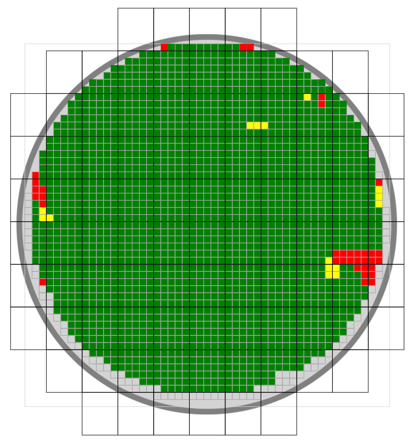

# uia-wafermap

```js
var shotmap = uia.shotmap('id')           // element id
  .wafer(200, 3, 9, 'bottom')             // wafer size
  .die(3.76, 3.74)                        // die size
  .reticle(5, 6, 0.3, -9.81)              // reticle size
  .create()                               // create shotmap
  .visibility('wafer2_cross', 'hidden');  // hide cross line

var data = shotmap.data(49, 51)           // create waferdata
  .layer('1', layer1)                     // add layer1
  .layer('2', layer2);                    // add layer2

shotmap.bind(data, 1, 0);                 // bind data to shotmap
```

